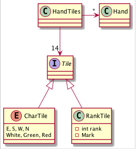
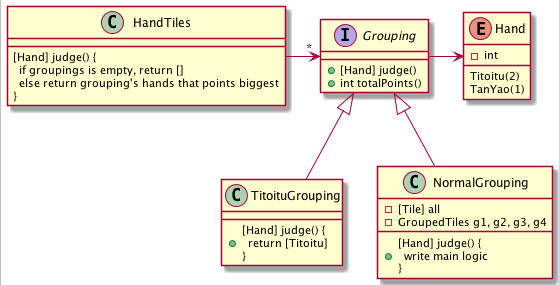
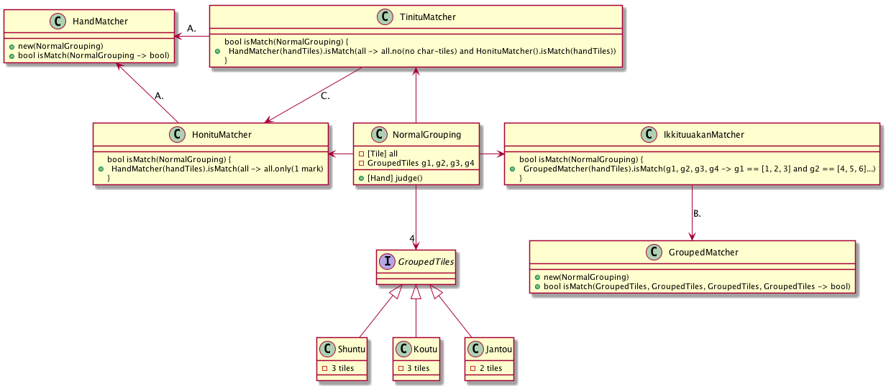
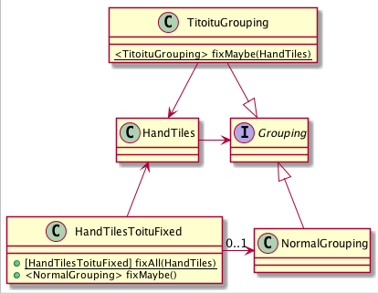

# 考えを文書にしてみる
## 僕のやり方
**型さえ辻褄を合わせれば大丈夫**  

細かい手段までは最初は考えない。それはきっと後で僕が何とかしてくれる。まずは流れだけ。

## 超ざっくりルール
+ 補完や vi との相性が悪いので、日本語クラス名にはせず、素直に僕の普段のローマ字入力に従う
+ 正しい麻雀用語にはそんなにこだわらない
+ 基本クラス及び単語
  + 牌は`Tile`
  + 数牌は`RankTile`として、数値と牌種から成る
  + ~~数値は`int`で`rank`~~ やっぱり`Rank`
  + 牌種は`enum`で`Mark`
  + 字牌は`CharTile`として`Tile`を継承した`enum`とする
    + 直和型使えれば`Tile = RankTile { rank, mark } | E | S | W | N | White | Green | Red`みたいに出来ると思ったけど、`interface`で実現する
  + 手牌は`HandTiles`
  + 役は`Hand`
  + `HandTiles`は複数の`Hand`を成立させる
+ クラス図の略記の自分ルール
  + `List<T>`は`[T]`とする
  + `Option<T>`は`<T>`とする
  + 他重度は 1 じゃあ無い場合に書く
  + 関数の引数は`, `で列挙し、戻り値との境は`->`とする
+ java だけど、javaslang を使って functional に書いてみたい



## 1. 判定の大きな流れ
### 役が成立する場合は、14 枚の分け方にパターンがあるな
七対子や国士無双のような特殊な形と、基本の (3), (3), (3), (3), (2) の形。  
（便宜上、前者を特殊系、後者を基本形ということにする）

**大半の役は基本形だから、役判定は基本形に対して実行しよう**

### 14 枚が満たす分け方を全て列挙し、そのうち基本形に対してのみ役判定を行う
+ 特殊系（今回は七対子のみ、成立するかは 0..1 ）
+ 基本形（雀頭の選び方によって複数成立する）
  + [②, ②, ③, ③, ④, ④, ⑤, ⑤] を [②, ②], [③, ④, ⑤], [③, ④, ⑤] とするか [②, ③, ④], [②, ③, ④], [⑤, ⑤] とするか
+ 役無し
  + なにも成立しない場合

**このまとめ方を型にしてみよう。分類結果はリストで持って、空リストなら役無しだ。**  
**どうやって (3), (3), (3), (3), (2) にするかは、後で僕が何とかしてくれる。出来ないことはないだろうから、型の筋だけ通す。**


  
### 当然基本形の (3) および (2) の部分には、パターンがある
+ 順子: [1, 2, 3]
+ 刻子: [1, 1, 1]
+ 対子: [1, 1]

### 基本形の役を眺めていたら、役が判定対象とする範囲のような物がある気がした
+ A. 手牌全体が特定の条件を満たすか（例: タンヤオ, 混一色）
+ B. 複数の順子が特定の条件を満たすか（例: 一盃口, 一気通貫）

**役が成立するパターンをそれぞれクラスにして、判定してもらおう。**  

こんな感じで関数を用意しておくと組み合わせやすそう
```java
tiles -> tiles.no(1 and 9 and CharTile)
```
けど、B. のパターンは手牌を渡して順子を見ようとするとこうなっちゃうな
```java
tiles -> tiles[0] == [1, 2, 3] and tiles[1] == [4, 5, 6] and  tiles[2] == [7, 8, 9]
```
それは面倒だしインデックスアクセスはなんか嫌なので、A. B. で型を分けて、unapply 出来る様にしておこう
```java
HandMatcher(tiles).isMatch(tiles -> 1 and 9 and CharTile)
```
```java
GroupedMatcher(tiles).isMatch(g1, g2, g3, g4 -> g1 == [1, 2, 3] and g2 == [4, 5, 6] and g3 == [7, 8, 9])
```
そういえば、もう１パターンある

+ C. 特定の役を満たし、かつ手牌全体が特定の条件を満たす（例: 混一色に対する清一色）



## 2. ざっと１周したので、戻って 14 枚の牌を分けるところを考えよう
### 七対子は多分超簡単
+ 14 枚の牌にユニークかけて 7 枚になったら七対子
  + [1, 1], [1, 1], [4, 4]... みたいに、同じ対子がある場合は成立しないってのも、これで対応できる

### 問題はやっぱり基本形
考えてみる。

+ とりあえず同じ牌が 2 枚以上ある場合は、そこを雀頭として確定させてしまう
  + 先にこれをしないと、[3, 3, 3, 3, 4, 5, 5, 5, 5] や [3, 3, 3, 4, 5, 5, 5, 5] とかを考える難易度が上がる気がしたから
+ 残った 12 枚を牌種ごとにまとめる
  + ここで 3 の倍数にわけられなければ (3), (3), (3), (3), (2) は成立しない
+ 値順にソートして単純に 3 枚ずつ分け、順子か刻子が成立するかを確認する

これを全ての雀頭の決め方で検討すると、数パターンもしくは０パターンが成立するはず。

クラス的には`七対子`は成立するかわからないので`<TitoituGrouping>`で返す。  
`NormalGrouping`は成立する雀頭の選び方全てに対して、`0..1`で戻ってくる。  

`Option`のリストを作って適当に flat にすれば良さそう。


クラスのフィールドまで決めてないので、コンストラクタでやるかファクトリでも作るかは後で考える。

## これで大まかな設計は終わり
これくらいを大体２−３日の通勤時間かなんかにぼんやりと考えている。  
大体これくらい考えられたら、「ん〜、なんか、出来る気がする」って感じがしてくる。

### 詳細設計前に、ここまでで気になったことをざっと列挙
#### `Grouping`は`Mentu`に変える
+ (2) と (3) を interface で混ぜちゃうと、逆に isinstanceof みたいなのが必要になりそうな気がしたから

#### 状態には依存したくない、宣言的に書きたい
+ この手の分類や判定では、小さく作って上手く組み合わせるようにするとやりやすい
+ 参照透過性を最大限に活用する、そのためのフィールド設計をちゃんとやる

**後できっと僕が何とかしてくれる**

#### 七対子とタンヤオが複合できない
気付いてなかった。

七対子は順子がないので`GroupedMatcher`は型が合わない。
けどよく考えると七対子と複合できる役は全て`HandMatcher`だと思うので、そっちとぶつければ大丈夫だろう。

**細かい整合は後できっと僕が何とかしてくれる**

#### あると良さそうだと思った処理
```java
Tile tile = new Tile(new Rank(1), M)
```

とか毎回やるの面倒なので、適当な creation-method を作っておく。    
本当はテストコードの可読性のためなのでテストパッケージでやるべきなんだけど、今回は手抜き。

```java
Tile tile = $(1, M)
```

あとは`Tile`にある程度の属性判定を持たせておくのが、オブジェクト指向的には妥当そう？

```java
tile.isYaotyuhai()
tile.isGreen()
```

順子も当然比べられること。その際には任意の比べ方を融通できること。

```java
g1.same(g2).on(rank)
g1.same(g2).on(mark)
g1.same(g2).on(identity)
```

`identity`は何もしない関数のこと。これで完全一致も同様に実現可能。

14 枚に対してもある程度の判定を準備しておく。

```Java
tiles.no(yaotyuhai)
tiles.all(green)
```

**詳細な置き場所は型は後で僕が決めてくれる**

## 3. 詳細なクラス図を書く
これくらい考えたらもう十分な気がしてコード書きたくなりもするけど、きっちりクラス図を書いてみる。

ここでのクラス図は、そのままコーディングが可能な粒度にまで細かくする。  
具体的には、引数と戻り値は全てカッチリ決め、実装時との「あ、これじゃあ引数足りないや」ってのを限りなくゼロにすることを目標にしている。


とどのつまり全ての処理は「何かに基づいて何かを返すだけ」なので、それが整理できてないと甘いよね、って考え方。